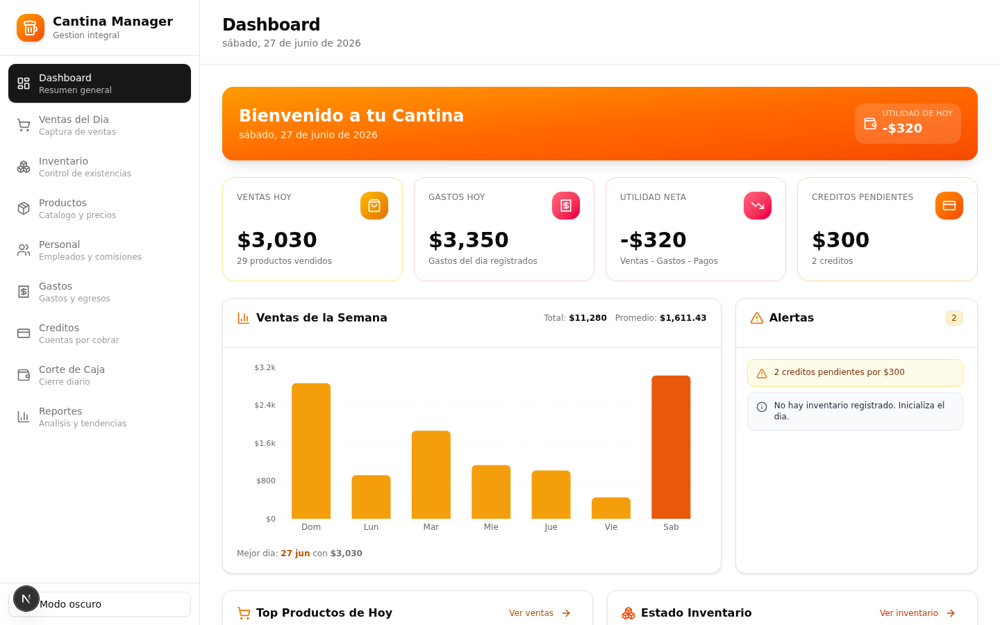
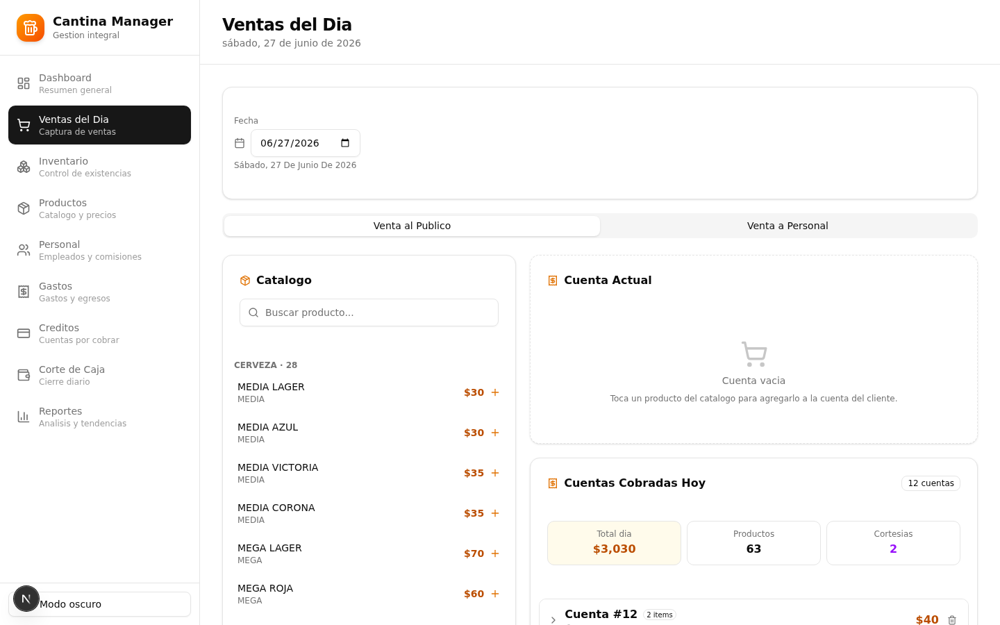
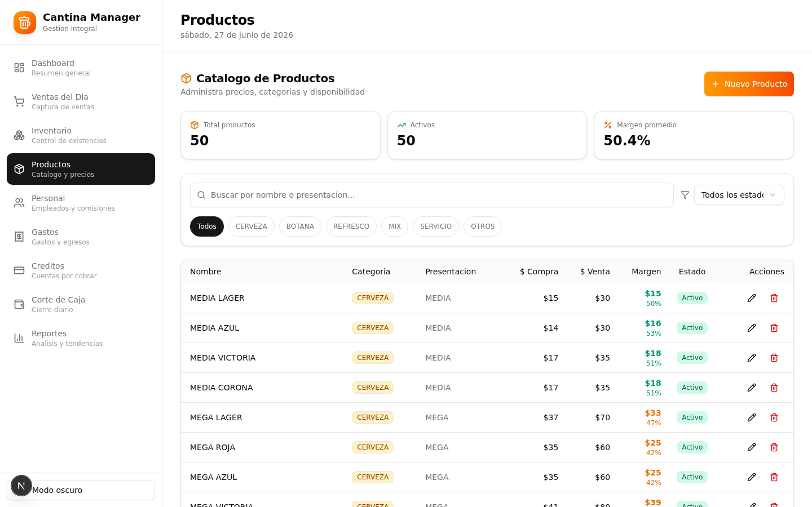
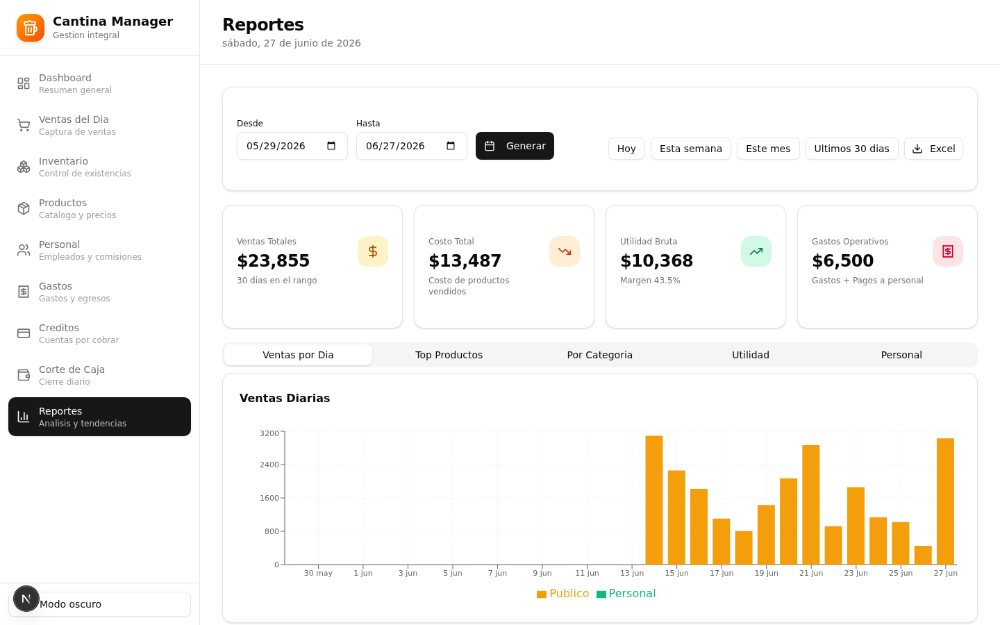
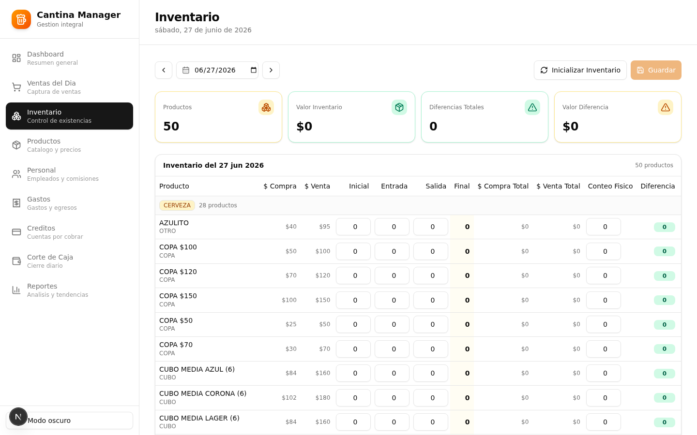

# 🍺 Cantina Manager

Sistema integral de gestión para cantina/bar construido con Next.js, TypeScript y Prisma. Reemplaza la administración manual en Excel por una aplicación web con punto de venta (POS), control de inventario, gestión de personal, y reportes analíticos.



## 🎯 El Problema

Un bar/cantina en México llevaba toda su administración en un archivo de Excel con una hoja por día que contenía 5 secciones manuales: venta al público, venta al personal, venta de fichas, inventario y resumen del día. Este método era propenso a errores, difícil de consultar históricamente, y no permitía generar reportes o analíticas del negocio.

## ✨ La Solución

Una aplicación web responsive que digitaliza y automatiza todas las operaciones del negocio:

- **Punto de Venta (POS)**: registra cuentas/comandas con múltiples productos y cálculo automático del total
- **Inventario diario**: control de existencias con conteo físico y detección de diferencias
- **Gestión de personal**: empleados, venta de fichas, comisiones y pagos
- **Corte de caja**: cierre diario con cálculo automático desde ventas, gastos y pagos
- **Reportes**: analítica de ventas, utilidad, top productos y desempeño del personal
- **Dashboard**: KPIs en tiempo real, gráficos de ventas y alertas de inventario

## 🖼️ Capturas

### Punto de Venta (POS)


### Catálogo de Productos


### Reportes Analíticos


### Control de Inventario


## 🏗️ Arquitectura

```
┌─────────────────────────────────────────────────────┐
│                    NAVEGADOR                         │
│   React 19 + Tailwind CSS 4 + shadcn/ui             │
│   TanStack Query + Recharts + Sonner                │
│                                                      │
│   9 módulos: Dashboard, Ventas (POS), Inventario,   │
│   Productos, Personal, Gastos, Créditos,            │
│   Corte de Caja, Reportes                           │
└──────────────────────┬──────────────────────────────┘
                       │ HTTP / REST
                       ▼
┌─────────────────────────────────────────────────────┐
│              NEXT.JS 16 API ROUTES                   │
│              27 endpoints REST                       │
│                                                      │
│  /api/sales  /api/products  /api/staff  /api/reports│
│  /api/inventory  /api/expenses  /api/credits        │
│  /api/cash-closing  /api/dashboard                  │
└──────────────────────┬──────────────────────────────┘
                       │ Prisma ORM
                       ▼
┌─────────────────────────────────────────────────────┐
│           PostgreSQL (Supabase)                      │
│              9 modelos relacionales                  │
└─────────────────────────────────────────────────────┘
```

Arquitectura **full-stack monolítica**: frontend y backend en el mismo proyecto Next.js, ideal para proyectos pequeños sin necesidad de microservicios.

## 🛠️ Stack Tecnológico

| Capa | Tecnología | Propósito |
|------|-----------|-----------|
| **Framework** | Next.js 16 (App Router) | Rendering, routing y API endpoints |
| **Lenguaje** | TypeScript 5 | Tipado estático, prevención de errores |
| **Estilos** | Tailwind CSS 4 + shadcn/ui | Sistema de diseño consistente |
| **Estado** | TanStack Query | Cache y sincronización con el servidor |
| **Base de datos** | PostgreSQL (Supabase) | Almacenamiento persistente en la nube |
| **ORM** | Prisma 6 | Capa de acceso a datos tipada |
| **Gráficos** | Recharts | Visualizaciones para dashboard y reportes |
| **Iconos** | Lucide React | Iconografía moderna |
| **Notificaciones** | Sonner | Toasts de feedback al usuario |
| **Runtime** | Bun | Ejecución ultrarrápida de JavaScript |

## 📊 Modelo de Datos

```
Product ──┬── Sale ────┬── Staff
          │             │
          ├── TokenSale─┘
          │
          ├── DailyInventory
          │
          └── (catálogo)

Expense          ← gastos del día
Credit           ← cuentas por cobrar
StaffPayment     ← pagos a empleados (sueldo + comisión - consumo)
DailyCashClosing ← corte de caja diario
```

### Concepto clave: `ticketId`

El campo `ticketId` en el modelo `Sale` agrupa todos los productos de una misma cuenta/comanda. Cuando un cliente consume 3 cervezas + 2 botanas, se crean 5 registros `Sale` que comparten el mismo `ticketId`, permitiendo cobrar la cuenta completa de una sola vez y consultar su detalle posteriormente.

## 🚀 Características

### Punto de Venta (POS)
- Catálogo de productos agrupado por categoría con buscador en tiempo real
- Carrito de cuenta actual con edición de cantidades, precios y cortesías
- Cobro de cuenta completa con un solo clic
- Historial de cuentas cobradas en el día, expandibles para ver detalle
- Soporte para venta al público y venta a personal (con selección de empleado)

### Dashboard
- KPIs en tiempo real: ventas hoy, gastos, utilidad neta, créditos pendientes
- Gráfico de barras con ventas de la semana
- Top 5 productos vendidos hoy
- Estado de inventario con alertas de stock bajo
- Panel de alertas inteligentes

### Inventario
- Control diario por producto: inicial, entrada, salida, final
- Conteo físico con cálculo automático de diferencias
- Inicialización automática desde el día anterior
- Valoración del inventario a precio de compra y venta
- Observaciones por producto

### Reportes
- Análisis por rango de fechas con presets rápidos (hoy, semana, mes, 30 días)
- 5 vistas: ventas por día, top productos, por categoría, utilidad, personal
- Gráficos interactivos (barras, pie, composed)
- Exportación a CSV
- Cálculo de márgenes de utilidad

## 📦 Instalación Local

### Prerrequisitos
- [Node.js](https://nodejs.org/) 18+ o [Bun](https://bun.sh/) runtime
- Una base de datos PostgreSQL (recomendado: [Supabase](https://supabase.com/) gratis)

### Pasos

```bash
# 1. Clonar el repositorio
git clone https://github.com/TU_USUARIO/cantina-manager.git
cd cantina-manager

# 2. Instalar dependencias
bun install

# 3. Configurar variables de entorno
cp .env.example .env
# Editar .env con tu URL de PostgreSQL de Supabase

# 4. Crear la base de datos (crea todas las tablas)
bun run db:push

# 5. Cargar datos iniciales (productos, empleados y datos demo)
bun run seed

# 6. Iniciar el servidor de desarrollo
bun run dev
```

La aplicación estará disponible en `http://localhost:3000`

### Para desarrollo local con SQLite (sin Supabase)

Si prefieres no configurar PostgreSQL para desarrollo local:

1. Cambia `provider = "postgresql"` a `provider = "sqlite"` en `prisma/schema.prisma`
2. Cambia `DATABASE_URL` en `.env` a `file:./db/custom.db`
3. Ejecuta `bun run db:push && bun run seed`

## 🌐 Deploy

### Vercel (recomendado)

1. Sube el repositorio a GitHub
2. En [vercel.com](https://vercel.com), importa el repositorio
3. Configura las variables de entorno:
   - `DATABASE_URL`: tu URL de PostgreSQL de Supabase
4. Deploy automático ✅

### Supabase (base de datos)

1. Crea un proyecto en [supabase.com](https://supabase.com)
2. Ve a Project Settings → Database
3. Copia la Connection String (formato pooling)
4. Úsala como `DATABASE_URL` en Vercel

## 📁 Estructura del Proyecto

```
cantina-manager/
├── prisma/
│   └── schema.prisma          # 9 modelos de base de datos
├── scripts/
│   └── seed.ts                # Carga inicial de datos
├── src/
│   ├── app/
│   │   ├── api/               # 27 endpoints REST
│   │   │   ├── sales/         # + tickets/[ticketId]
│   │   │   ├── products/
│   │   │   ├── staff/         # + tokens, payments
│   │   │   ├── inventory/     # + batch, init
│   │   │   ├── expenses/
│   │   │   ├── credits/
│   │   │   ├── cash-closing/  # + calculate
│   │   │   ├── dashboard/
│   │   │   └── reports/
│   │   ├── layout.tsx
│   │   └── page.tsx           # SPA con sidebar
│   ├── components/
│   │   ├── ui/                # 48 componentes shadcn/ui
│   │   ├── modules/           # 9 módulos de la app
│   │   ├── layout/            # Sidebar y navegación
│   │   └── providers.tsx      # ThemeProvider + QueryClient
│   └── lib/
│       ├── db.ts              # Cliente de Prisma
│       ├── format.ts          # Utilidades de formato
│       └── api-client.ts      # Helper de fetch
└── .env.example
```

## 📈 Métricas del Proyecto

- **27** endpoints de API
- **9** módulos de frontend
- **9** modelos de base de datos
- **48** componentes UI (shadcn/ui)
- **50** productos precargados
- **5** empleados precargados
- **268** ventas demo de 14 días
- **0** errores de lint

## 🎨 Decisiones de Diseño

- **Paleta amber/orange**: evoca el ambiente de bar/cantina, evita colores corporativos fríos
- **Mobile-first**: el sidebar colapsa en móvil, tablas con scroll horizontal, botones touch-friendly (44px)
- **Snapshots de precios**: cada venta guarda `unitPrice` y `purchasePrice` al momento de la transacción, preservando el historial aunque cambien los precios del catálogo
- **API REST en vez de Server Actions**: mayor predecibilidad, testeabilidad y compatibilidad
- **TanStack Query**: manejo automático de cache, loading states y refetch
- **ticketId para agrupar cuentas**: permite cobrar múltiples productos como una sola cuenta

## 📝 Licencia

MIT - Libre uso para fines educativos y comerciales.

---

**Construido como proyecto de portafolio** demostrando desarrollo full-stack con asistencia de IA: análisis de requisitos desde un Excel real, diseño de schema, implementación de API REST, y UI/UX profesional.
